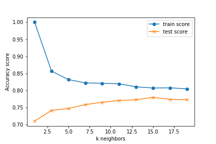

## Theasus



- Utilized a variety of machine learning models to predict customer churn in telecom industry
- Technologies: logistic regression, decision tree, random forest, k nearest neighbors, neural network, and support vector machine


```python

```
